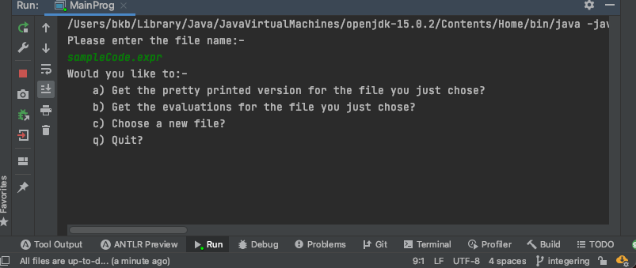
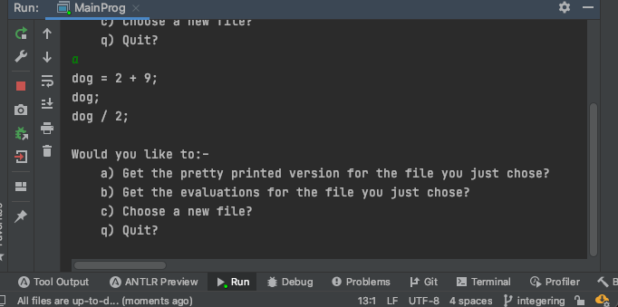
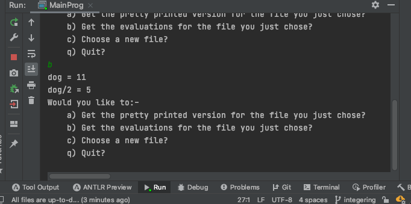
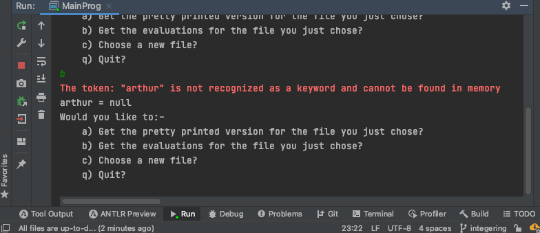

# Expression Analyser

### Assignment One for CE305 by bb18960 (Benjamin Kirk Brightwell)

[TOC]


# Specification

## Tokens

| Token identifier | Why it's used                                                |
| ---------------- | ------------------------------------------------------------ |
| ID               | Represents a word that is associated with a variable name    |
| INT              | Represents an integer in the program                         |
| NEW_LINE         | Represents a new line and account for the carriage return character used commonly on Windows systems |
| WS               | Superfluous white space (which gets removed)                 |
| ENDSTMT          | An identifier representing the end of a statement            |
| MUL              | An identifier indicating that multiplication is desired      |
| DIV              | An identifier indicating that division is desired            |
| ADD              | An identifier indicating that addition is desired            |
| SUB              | An identifier indicating that subtraction is desired         |
| POW              | An identifier indicating that exponentiation is desired      |


## Syntax

The grammar for my project is defined in the **AssigOneGrammar.g4** file. It is written as to follow the rules for the ANTLR version 4 standard.


In my language a program is something that consists of multiple statements.


A statement can either be a call to display the value of an expression; setting a variable (an ID) to a certain value or an empty new line.


An expression can be a mathematical operation like an addition, division, exponentiation, etc; an ID name; an integer or an expression in parentheses.


# Implementation

## How to use

One can run the MainProg main method and be presented with the option to choose a file name. From that point, you can choose whether you'd like to see the pretty printed version of the code you've just entered, get the evaluations for the program (effectively run it), choose a new file or quit.




### Pretty print

```
dog  =2+9;
dog;
dog/2;
```

For the above file, the pretty printed representation of that program comes to be:-




Notice how the unnecessary whitespace is removed and in instead, we have nice formatting that makes the program easier to read on the eyes.

### Evaluations

If one chose the evaluations option instead, you would be presented with the value of dog and then, the value of dog/2 as seen below:-




I decided to implement it in this way so that you could see what part of the code was the reason for a printing of its value.


## What's going on

### Exception handling

One of the exceptions in the program is when you try to use a keyword that is otherwise not known. This could be indicative of the idea that they are trying to access the value at that variable even though it has yet to be set.


The following file is used for this example:-

```
arthur;

```


When asking for the evaluation, the following occurs:-




This is implemented using the class **NotInMemoryException**.


# How tools were applied

A list of tools that I used to complete this project were:-

| Tool                                      | Version                       | Why I used it                                                | Link to tool                                       |
| ----------------------------------------- | ----------------------------- | ------------------------------------------------------------ | -------------------------------------------------- |
| IntelliJ IDEA 2020.3.2 (Ultimate Edition) | 11.0.9.1+11-b1145.77 x86_64   | I used this as my IDE (Integrated Development Environment). It provides helpful tips to make editing plain text files painless. | https://www.jetbrains.com/idea/                    |
| openJDK 15                                | v15.0.2                       | Used to compile and debug my Java source code.<br /><br />I used this late version of the JDK (Java Development Kit) because I appreciate the simplified switch statements that aren't on offer in legacy JDK 8 versions. | https://jdk.java.net/15/                           |
| Mac mini 2018                             | Running macOS Big Sur v11.2.1 | This was the hardware and operating system that I used to develop and test the software that I produced.<br /><br />I appreciate the unix features that the system has making it very easy to use the command line to troubleshoot. | https://www.apple.com/uk/mac-mini/specs/           |
| ANTLR v4 Complete Jar                     | v4.9                          | Used to provide the generated ANTLR lexer and parser with common features needed in interpreters and compilers.<br /><br />For instance, a ParseTree is something that will apply to all generated ANTLR code and so is needed in a general sense. | https://www.antlr.org/download.html                |
| ANTLR v4 IntelliJ plugin                  | v1.16                         | Helped me understand in an interactive way whether the grammar I was producing was effective with the useful window at the bottom that allows you to type in an expression and see the tree.<br /><br />Also, through using this you can create the generated Java parser and lexer that follows the rules prescribed in the grammar. | https://plugins.jetbrains.com/plugin/7358-antlr-v4 |
| Typora                                    | v0.9.9.36.2                   | Used to create this report. It's a markdown editor which can then be used to export to pdf (as well as many other things). | http://typora.io                                   |
| git                                       | v2.24.0                       | Version control allowing me to swiftly program with the safe knowledge that my work is backed up if I need to revert back to previous versions. | https://git-scm.com/                               |


------


# References

The resources that I used to fuel my understanding of ANTLR and surrounding topics were the following:-


| [1]  | T. Parr, *The Definitive ANTLR 4 Reference, 2nd Edition*, 2nd ed. Dallas, Texas: Pragmatic Programmers, LLC, 2012. |
| ---- | ------------------------------------------------------------ |
| [2]  | G. Tomassetti, “The ANTLR Mega Tutorial,” *tomassetti.me*. [Online]. Available: https://tomassetti.me/antlr-mega-tutorial/. [Accessed: 01-Mar-2021]. |
| [3]  | G. Loganathan, “ANTLR Hello World! - Arithmetic Expression Parser,” *Java Helps*. [Online]. Available: https://www.javahelps.com/2019/04/antlr-hello-world-arithmetic-expression.html. [Accessed: 01-Mar-2021]. |
| [4]  | P. Blenkhorn, *red and abstract painting*. Sensory Art House, 2019. |

